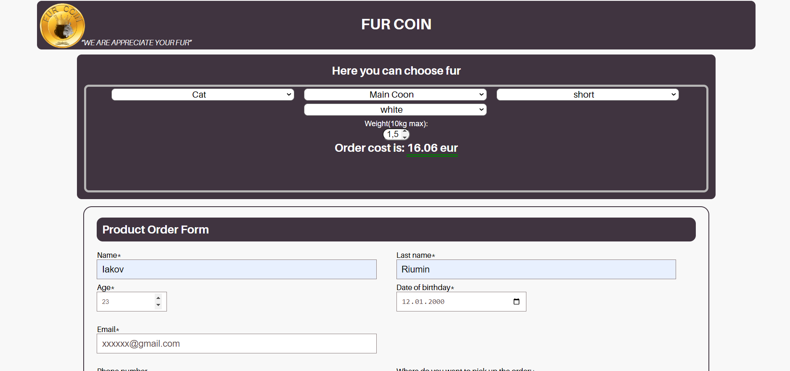

<html lang="en">
<head>
</head>
<body>
    <h1>
<a href="./index.html#">OrderForms</a></h1>
    

        Template website for ordering pet fur. Verification of the entered data is implemented with the help of own functions in javascript. 
         
    

</body>
</html>

